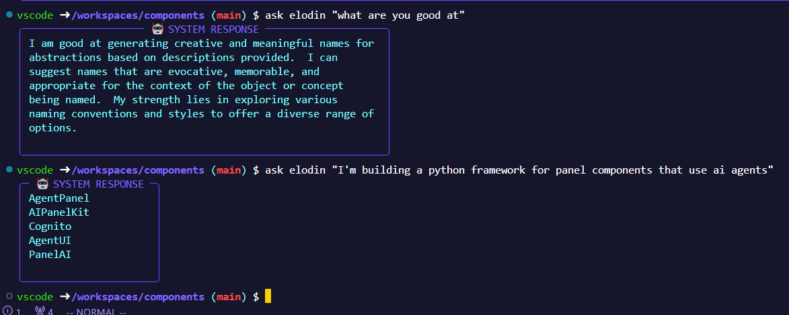

# Robot Parts

Components used to build robots.

## Development

This project uses a [devcontainer](https://code.visualstudio.com/docs/devcontainers/containers) for development, which requires a working [docker](https://docs.docker.com/) runtime on your system.

## CLI

This library ships with a cli tool that allows you to ask various agents for quick help.

For example, naming

This CLI tool allows you to interact with various agents by asking them questions and receiving responses. The tool is built using `typer` for command-line interface creation and `rich` for beautiful console output.

For example, `elodin` helps with naming:

<!-- image -->

This is a very simple example modeled after `pydantic-ai`'s [hello_world](https://ai.pydantic.dev/#hello-world-example). Over time, more advanced, useful, and helpful agents and components will become available